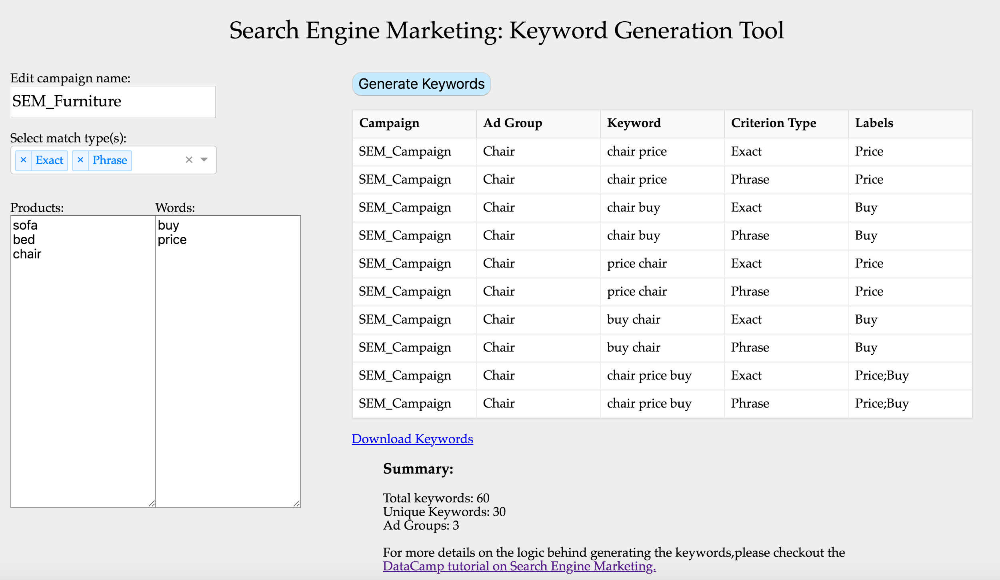

advertools: create, scale, and manage online campaigns
======================================================

| A digital marketer is a data scientist.
| Your job is to manage, manipulate, visualize, communicate, understand,
  and make decisions based on data.

You might be doing basic stuff, like copying and pasting text on spread
sheets, you might be running large scale automated platforms with
sophisticated algorithms, or somewhere in between. In any case your job
is all about working with data.

| As a data scientist you don’t spend most of your time producing cool visualizations or finding great insights. The majority of your time is spent wrangling with URLs, figuring out how to stitch together two tables, hoping that the dates, won’t break, without you knowing, or trying to generate the next 124,538 keywords for an upcoming campaign, by the end of the week!

| advertools is a Python package, that can hopefully make that part of your job a little easier.

I have a tutorial on DataCamp that demonstrates a real-life example of
how to use `Python for creating a Search Engine Marketing campaign`_.

I also have an interactive tool based on this package, where you can
`generate keyword combinations easily`_.

Main Uses:
~~~~~~~~~~

-  **Generate keywords:** starting from a list of products, and a list
   of words that might make sense together, you can generate a full
   table of many possible combinations and permutations of relevant
   keywords for that product.
   The output is a ready-to-upload table to get you started with
   keywords.

.. code:: python

   >>> import advertools as adv
   >>> adv.kw_generate(products=['toyota'],
                       words=['buy', 'price'],
                       match_types=['Exact']).head()
   ...        Campaign Ad Group           Keyword Criterion Type
       0  SEM_Campaign   toyota        toyota buy          Exact
       1  SEM_Campaign   toyota      toyota price          Exact
       2  SEM_Campaign   toyota        buy toyota          Exact
       3  SEM_Campaign   toyota      price toyota          Exact
       4  SEM_Campaign   toyota  toyota buy price          Exact

-  **Create ads:** Two main ways to create text ads, one is from scratch
   (bottom-up) and the other is top down (given a set of product names).

1. From scratch: This is the tradiditional way of writing ads. You have
   a template text, and you want to insert the product name dynamically
   in a certain location. You also want to make sure you are within the
   character limits. For more details, I have a `tutorial on how to
   create multiple text ads from scratch`_.

.. code:: python

   >>> ad_create(template='Let\'s count {}',
                 replacements=['one', 'two', 'three'],
                 fallback='one', # in case the total length is greater than max_len
                 max_len=20)
   ["Let's count one", "Let's count two", "Let's count three"]

   >>> ad_create('My favorite car is {}', ['Toyota', 'BMW', 'Mercedes', 'Lamborghini'], 'great', 28)
   ['My favorite car is Toyota', 'My favorite car is BMW', 'My favorite car is Mercedes',
   'My favorite car is great'] # 'Lamborghini' was too long, and so was replace by 'great'

2. Top-down approach: Sometimes you need to start with a given a list of
   product names, which you can easily split them into the relevant ad
   slots, taking into consideration the length restrictions imposed by
   the ad platform.
   Imagine having the following list of products, and you want to split
   each into slots of 30, 30, and 80 characters (based on the AdWords
   template):

.. code:: python

   >>> products = [
       'Samsung Galaxy S8+ Dual Sim 64GB 4G LTE Orchid Gray',
       'Samsung Galaxy J1 Ace Dual Sim 4GB 3G Wifi White',
       'Samsung Galaxy Note 8 Dual SIM 64GB 6GB RAM 4G LTE Midnight Black',
       'Samsung Galaxy Note 8 Dual SIM 64GB 6GB RAM 4G LTE Orchid Grey'
   ]
   >>> [adv.ad_from_string(p) for p in products]
   ... [['Samsung Galaxy S8+ Dual Sim', '64gb 4g Lte Orchid Gray', '', '', '', ''],
        ['Samsung Galaxy J1 Ace Dual Sim', '4gb 3g Wifi White', '', '', '', ''],
        ['Samsung Galaxy Note 8 Dual Sim', '64gb 6gb Ram 4g Lte Midnight', 'Black', '', '', ''],
        ['Samsung Galaxy Note 8 Dual Sim', '64gb 6gb Ram 4g Lte Orchid', 'Grey', '', '', '']]

| Each ad is split into the respective slots, making sure they contain
  complete words, and that each slot has at most the specific number of
  slots allowed.
| This can save time when you have thousands of products to create ads
  for.

-  **Analyze word frequency:** Calculate the absolute and weighted
   frequency of words in a collection of documents to uncover hidden
   trends in the data. This is basically answering the question, ‘What
   did we write about vs. what was actually read?’
   Here is a tutorial on DataCamp on `measuring absolute vs weighted
   frequency of words`_.

| The package is still under heavy development, so expect a lot of
  changes.
| Feedback and suggestions are more than welcomed.

Installation
~~~~~~~~~~~~

.. code:: bash

   pip install advertools

Conventions
~~~~~~~~~~~

Function names mostly start with the object you are working on:

| ``kw_``: for keywords-related functions
| ``ad_``: for ad-related functions
| ``url_``: URL tracking and generation

.. _measuring absolute vs weighted frequency of words: https://www.datacamp.com/community/tutorials/absolute-weighted-word-frequency

.. _Python for creating a Search Engine Marketing campaign: https://www.datacamp.com/community/tutorials/sem-data-science
.. _generate keyword combinations easily: https://www.dashboardom.com/advertools
.. _tutorial on how to create multiple text ads from scratch: https://nbviewer.jupyter.org/github/eliasdabbas/ad_create/blob/master/ad_create.ipynb